#  3D Manufacturing Format

## Core Specification & Reference Guide


| **Version** | 1.2.4 |
| --- | --- |
| **Status** | Draft |

## Disclaimer

THESE MATERIALS ARE PROVIDED "AS IS." The contributors expressly disclaim any warranties (express, implied, or otherwise), including implied warranties of merchantability, non-infringement, fitness for a particular purpose, or title, related to the materials. The entire risk as to implementing or otherwise using the materials is assumed by the implementer and user. IN NO EVENT WILL ANY MEMBER BE LIABLE TO ANY OTHER PARTY FOR LOST PROFITS OR ANY FORM OF INDIRECT, SPECIAL, INCIDENTAL, OR CONSEQUENTIAL DAMAGES OF ANY CHARACTER FROM ANY CAUSES OF ACTION OF ANY KIND WITH RESPECT TO THIS DELIVERABLE OR ITS GOVERNING AGREEMENT, WHETHER BASED ON BREACH OF CONTRACT, TORT (INCLUDING NEGLIGENCE), OR OTHERWISE, AND WHETHER OR NOT THE OTHER MEMBER HAS BEEN ADVISED OF THE POSSIBILITY OF SUCH DAMAGE.

## Table of Contents

- [Preface](#preface)
  * [About this Specification](#about-this-specification)
  * [Document Conventions](#document-conventions)
  * [Language Notes](#language-notes)
  * [Software Conformance](#software-conformance)
- [Part I. 3MF Documents](#part-i-3mf-documents)
  * [Chapter 1. 3MF Document Format](#chapter-1-3mf-document-format)
    + [1.1. Package](#11-package)
  * [Chapter 2. Parts and Relationships](#chapter-2-parts-and-relationships)
    + [2.1. 3D Payload](#21-3d-payload)
    + [2.2. Part Naming Recommendations](#22-part-naming-recommendations)
    + [2.3. 3MF Document Markup](#23-3mf-document-markup)
  * [Chapter 3. 3D Models](#chapter-3-3d-models)
    + [3.1. Coordinate Space](#31-coordinate-space)
    + [3.2. Relative Directions and Measurement](#32-relative-directions-and-measurement)
    + [3.3. 3D Matrices](#33-3d-matrices)
    + [3.4. Model](#34-model)
  * [Chapter 4. Object Resources](#chapter-4-object-resources)
    + [4.1. Meshes](#41-meshes)
    + [4.2. Components](#42-components)
  * [Chapter 5. Material Resources](#chapter-5-material-resources)
    + [5.1. Base Material](#51-base-material)
  * [Chapter 6. 3MF Document Package Features](#chapter-6-3mf-document-package-features)
    + [6.1. Package Thumbnail and Object Thumbnail](#61-package-thumbnail-and-object-thumbnail)
    + [6.2. Core Properties](#62-core-properties)
    + [6.3. Digital Signatures](#63-digital-signatures)
    + [6.4. Protected Content](#64-protected-content)
- [Part II. Appendixes](#part-ii-appendixes)
  * [Appendix A. Glossary](#appendix-a-glossary)
  * [Appendix B.1. 3MF XSD Schema](#appendix-b1-3mf-xsd-schema)
  * [Appendix B.2. 3MF Metadata Example](#appendix-b2-3mf-metadata-example)
  * [Appendix C. Standard Namespaces and Content Types](#appendix-c-standard-namespaces-and-content-types)
    + [C.1 Content Types](#c1-content-types)
    + [C.2 Relationship Types](#c2-relationship-types)
    + [C.3 Namespaces](#c3-namespaces)

# Preface

## About this Specification

The ***3D Manufacturing Format***, or _3MF_, describes the set of conventions for the use of XML and other widely available technologies to describe the content and appearance of one or more 3D models. It is written for developers who are building systems to process 3MF content.

A primary goal of this specification is to ensure the interoperability of independently created software and hardware systems that produce or consume 3MF content. This specification defines the formal requirements that producers and consumers must satisfy in order to achieve interoperability.

This specification describes a 3D model and containing format called the _3MF Document_. The format requirements are an extension of the packaging requirements described in the Open Packaging Conventions (OPC) specification. That specification describes packaging and physical format conventions for the use of XML, Unicode, ZIP, and other technologies and specifications to organize the content and resources that make up any model. They are an integral part of the 3MF specification.

Understanding this specification requires working knowledge of the Extensible Markup Language (XML) and XML Namespace specifications. Full understanding might also require domain knowledge of common terms and procedures within the 3D manufacturing sector, although every effort has been made to minimize such reliance.

The 3MF Consortium offers [a free to use open source implementation](https://github.com/3MFConsortium/lib3mf) of this specification in order to allow an easy adoption of the format in applications handling 3D content.

Part I, "3MF Documents," presents the details of the primarily XML-based 3MF Document format. This section describes the XML markup that defines the composition of 3D documents and the appearance of each model within the document.

Part II, "Appendixes," contains additional technical details and schemas too extensive to include in the main body of the text as well as convenient reference information.

The information contained in this specification is subject to change. Every effort has been made to ensure its accuracy at the time of publication.

## Document Conventions

Except where otherwise noted, syntax descriptions are expressed in the ABNF format as defined in RFC 4234.

Glossary terms are formatted like _this_.

Syntax descriptions and code are formatted as `Markdown code blocks.`

Replaceable items, that is, an item intended to be replaced by a value, are formatted in _`monospace cursive`_ type.

Notes are formatted as follows:

>**Note:** This is a note.

## Language Notes

In this specification, the words that are used to define the significance of each requirement are written in uppercase. These words are used in accordance with their definitions in RFC 2119, and their respective meanings are reproduced below:

- _MUST._ This word, or the adjective "REQUIRED," means that the item is an absolute requirement of the specification.
- _SHOULD._ This word, or the adjective "RECOMMENDED," means that there may exist valid reasons in particular circumstances to ignore this item, but the full implications should be understood and the case carefully weighed before choosing a different course.
- _MAY._ This word, or the adjective "OPTIONAL," means that this item is truly optional. For example, one implementation may choose to include the item because a particular marketplace or scenario requires it or because it enhances the product. Another implementation may omit the same item.

## Software Conformance

Most requirements are expressed as format or package requirements rather than implementation requirements.

In order for consumers to be considered conformant, they must observe the following rules:

- They MUST NOT report errors when processing conforming instances of the document format except when forced to do so by resource exhaustion.
- They SHOULD report errors when processing non-conforming instances of the document format when doing so does not pose an undue processing or performance burden.

In order for producers to be considered conformant, they must observe the following rules:

- They MUST NOT generate any new, non-conforming instances of the document format.
- They MUST NOT introduce any non-conformance when modifying an instance of the document format.

Editing applications are subject to all of the above rules.

# Part I. 3MF Documents


# Chapter 1. 3MF Document Format

This specification describes how the 3MF Document format is organized internally and realized in 3D objects externally. It can be used as a stand-alone file format or as a payload in a print pipeline. It is built upon the principles described in the Open Packaging Conventions specification. 3MF Documents MUST observe all requirements and recommendations of that specification, except where indicated otherwise in this specification. The information presented here is intended both for _producers_, which emit content in the 3MF Document format, and _consumers_, which access and transform into 3D objects the contents of a 3MF document. An _editor_ is an entity that acts as both a producer and a consumer of content in the 3MF Document format. A _manufacturing device_ is a consumer that produces a physical part.

The 3MF Document format represents a _3D model_, or a representation of one or more physical object descriptions in a markup format. A file that implements this format includes the fundamental information necessary for a consumer to generate a physical object through additive manufacturing or basic subtractive manufacturing techniques. This includes resources such as textures that might be required to reproduce the exact desired appearance in terms of color or internal structures in terms of materials.

This format also includes optional components that build on the minimal set of components required to generate a physical object. This includes the ability to specify print job control instructions, to describe _assembly_ of objects intended to be generated simultaneously in an interlocked or disjoint manner, among others.

Finally, the 3MF Document format implements the common package features specified by the Open Packaging Conventions specification that support digital signatures and core properties.


## 1.1. Package

The 3MF Document format MUST use a ZIP archive for its physical model. The Open Packaging Conventions specification describes a packaging model, that is, how the package is represented internally with parts and relationships.

The ZIP archive MUST follow the [.ZIP File Format Specification](https://pkware.cachefly.net/webdocs/casestudies/APPNOTE.TXT) by PKWARE Inc.
Files within the ZIP archive that represents a 3MF document MUST use the compression method `Deflate` ("8 - The file is Deflated") or be `stored uncompressed` ("0 - The file is stored (no compression)") in accordance with the OPC specification ("Annex C, (normative) ZIP Appnote.txt Clarifications"). The consumers MUST support both the the PKWARE ZIP64:tm: extension and streaming extension. However as some older 3MF consumers are not able to consume ZIP64 files, the producers SHOULD produce plain ZIP files if the 3MF data fits and produce ZIP64 only if necessary. To support ZIP64 only if necessary in streaming mode, the producer may preallocate a custom block in the ZIP Local file header with an ID (0x9999) and overwrite it optionally with a ZIP64 extension block after finishing writing the compressed file block if the ZIP64 extension is found to be
necessary.

The 3MF Document format includes a well-defined set of parts and relationships, each fulfilling a particular purpose in the document. The format also extends the package features, including digital signatures and thumbnails.


# Chapter 2. Parts and Relationships

The packaging conventions described in the Open Packaging Conventions specification can be used to carry any payload. A _payload_ is a complete collection of interdependent parts and relationships within a package. This specification defines a particular payload that contains a 3D object definition and its supporting files: the 3D payload.

An OPC package that holds a 3D payload and follows the rules described in this specification is referred to as a 3MF Document. Producers and consumers of 3MF Documents can implement their own parsers and manufacturing devices based on this specification.


## 2.1. 3D Payload

A payload that has a 3D Model root part is known as a _3D payload_. There can be more than one 3D payload in a 3MF Document, but only one primary 3D payload.


### 2.1.1. 3D Parts and Payload Relationships

A specific relationship type is defined to identify the root of a 3D payload within a 3MF Document: the _3MF Document StartPart relationship_. The _primary 3D payload root_ is the 3D Model part that is referenced by the 3MF Document StartPart relationship to find the primary 3D payload in a package. The 3MF Document StartPart relationship MUST point to the 3D Model part that identifies the root of the 3D payload.

The payload includes the full set of parts required for processing the 3D Model part. All content to be used to manufacture an object described in the 3D payload MUST be contained in the 3MF Document. The parts that can be found in a 3MF Document are listed in Table 2-1. Relationships and content types for these parts are defined in Appendix C, "Standard Namespaces and Content Types." Each part MUST use an appropriate content type specified in Appendix C or in an extension specification to 3MF (see [2.3.1. Support for Versioning and Extensibility](#231-support-for-versioning-and-extensibility).

Parts included to the 3D payload are explicitly linked to the 3D payload root by relationship. 3MF Documents MUST NOT reference resources external to the 3MF Document package unless specified otherwise in an extension. For more information on relationships, see the Open Packaging Conventions specification.

Parts in the 3D payload MUST use one of the appropriate relationships described below to establish that relationship between two parts in the payload. There MUST NOT be more than one relationship of a given relationship type from one part to a second part. Relationship types are defined in Appendix C, "Standard Namespaces and Content Types."

Producers that generate a relationship MUST include the target part in the 3MF Document for any of the following relationship types: PrintTicket, StartPart, and Thumbnail. Consumers that access the target part of any relationship with one of these relationship types MUST generate an error if the part is not included in the 3MF Document.

_Table 2-1. 3MF Document parts_

| **Name** | **Description** | **Relationship Source** | **Required/Optional** |
| --- | --- | --- | --- |
| 3D Model | Contains the description of one or more 3D objects for manufacturing. | Package | REQUIRED |
| Core Properties | The OPC part that contains various document properties. | Package | OPTIONAL |
| Digital Signature Origin | The OPC part that is the root of digital signatures in the package. | Package | OPTIONAL |
| Digital Signature | OPC parts that each contains a digital signature. | Digital Signature Origin | OPTIONAL |
| Digital Signature Certificate | OPC parts that contain a digital signature certificate. | Digital Signature | OPTIONAL |
| PrintTicket | Provides settings to be used when outputting the 3D object(s) in the 3D Model part. | 3D Model | OPTIONAL |
| Package Thumbnail | Contains a small JPEG or PNG image that represents the 3D objects in the package or the package as a whole. | Package | OPTIONAL |
| Object Thumbnail | Contains a small JPEG or PNG image that represents a 3D object in a 3D Model. | 3D Model | OPTIONAL |
| 3D Texture | Contains a texture used to apply color to a 3D object in the 3D Model part (available for extensions) | 3D Model | OPTIONAL |
| Custom Parts | OPC parts that are associated with metadata | Package | OPTIONAL |

_Figure 2-1. A typical 3MF Document_

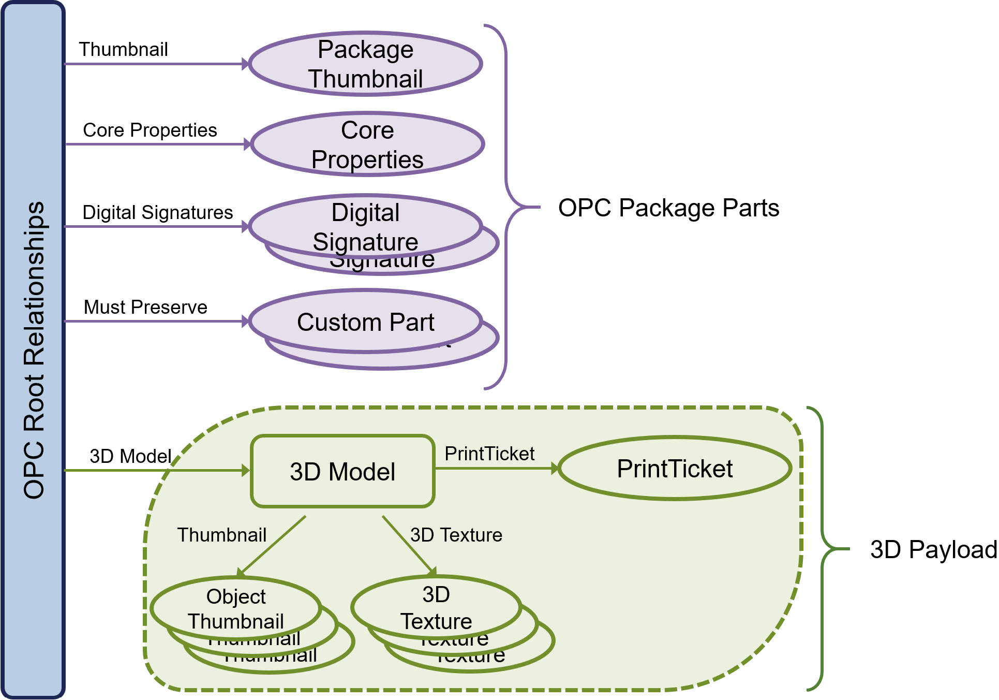


### 2.1.2. 3D Model Part

The _3D Model part_ contains definitions of one or more objects to be fabricated by 3D manufacturing processes. The 3D Model part is the only valid root of a 3D payload.

A 3D Model part has two sections: a set of resource definitions that include objects and materials, as well as a set of specific items to actually build. The content type of the 3D Model part is defined in Appendix C, "Standard Namespaces and Content Types."


### 2.1.3. Package Thumbnail and Object Thumbnail Part 

_Package Thumbnails_ and _Object Thumbnails_ are small images that represent the contents of an entire 3MF Document. Thumbnails enable external agents to view the contents of the 3MF Document easily.

Package Thumbnails MAY be defined for the entire package by referencing the thumbnail from the root model relationship file. Object Thumbnails MAY be defined for individual objects by using the object thumbnail attribute. These _thumbnail parts_ MUST be in either JPEG or PNG format.

All thumbnails in the 3MF document MUST be referenced via the thumbnail relationship.

For more information about the relationship type for thumbnail parts, see section [C.2, Relationship Types.](#c2-relationship-types)


### 2.1.4. PrintTicket Part

_PrintTicket parts_ provide user intent and device configuration information to printing consumers. A PrintTicket part can be attached only to a 3D Model part and each 3D Model part MUST attach no more than one _PrintTicket_. The PrintTicket format is governed by the specific consumer environment. For example, for printing on Microsoft Windows, valid PrintTicket settings are specified in the Print Schema Keywords for 3D Manufacturing specification.

If no PrintTicket is provided or the PrintTicket provided is not supported by the consumer, it is left to the consumer to apply its own defaults.


### 2.1.5. MustPreserve Relationship

Producers MAY add custom OPC parts to a 3MF package. For example, a software vendor may include annotations about an object referenced by a unique id.

A MustPreserve relationship indicates that Consumers SHOULD save associated parts when modifying the 3MF file even if they do not understand how to process the data.

Parts that must be preserved in this way MUST be associated with the package root through a MustPreserve relationship. If a custom OPC part is not referenced by a MustPreserve relationship then the consumer SHOULD NOT preserve these parts when modifying the 3MF as it is assumed they are no longer valid.

The following example demonstrates how to add a MustPreserve relationship:

```xml
<?xml version="1.0" encoding="UTF-8"?>
<Relationships xmlns="http://schemas.openxmlformats.org/package/2006/relationships">
<Relationship Target="/3D/3dmodel.model" Id="rel-1" Type="http://schemas.microsoft.com/3dmanufacturing/2013/01/3dmodel"/>
<Relationship Target="/Metadata/thumbnail.png" Id="rel0" Type="http://schemas.openxmlformats.org/package/2006/relationships/metadata/thumbnail" />
<Relationship Target="/Metadata/MustPreservePart.txt" Id="rel-2" Type="http://schemas.openxmlformats.org/package/2006/relationships/mustpreserve"/>
</Relationships>
```

## 2.2. Part Naming Recommendations

Producers and consumers of 3MF Documents refer to parts by name and use relationship names to identify the purpose of related parts. The Open Packaging Conventions specification describes the syntax for part name. However, following these rules alone can result in a package that is difficult for users to understand. For example, a user would have to open every Relationship part to know which parts are necessary to accurately manufacture a 3MF Document.

By choosing part names according to a well-defined, human-readable convention, the resulting package is easier to browse and specific parts are more easily located. Part names MUST still conform to the syntax specified in the Open Packaging Conventions specification.

It is RECOMMENDED that producers of 3MF Documents use the following part naming convention:

- The 3D Model part name SHOULD contain two segments, the first being "/3D/" and the second with the extension ".model" on the last segment, for example "/3D/3dModel.model".
- The PrintTicket part name SHOULD be associated via relationship with the 3D Model part and contains three segments, using "/3D/Metadata/" as the first two segments with the extension ".xml". For example, "/3D/Metadata/Model\_PT.xml".
- 3D Texture part names SHOULD contain three segments, using "/3D/Textures/" as the first two segments, for example "/3D/Textures/coloring.png". 3D Texture parts MUST be associated with the 3D Model part via a suitable relationship.
- The names of any non-standard parts that are associated with the 3D payload SHOULD contain 3 segments, using "/3D/Other/" as the first two segments.

Part names MUST use absolute paths, meaning all paths begin with "/". Part names MUST NOT be empty or lead with a period (e.g. "/3D/.png" or "/3D/").

When a part name is represented with Unicode, it SHOULD be represented with a Part URI Syntax, as described in the section 9.1.1.1 Part Name Syntax of the Open Packaging Conventions specification.


## 2.3. 3MF Document Markup

3MF Document markup has been designed to facilitate independent development of compatible systems that produce or consume 3MF Documents.

The design of 3MF Document markup reflects the tradeoffs between two, sometimes competing, goals:

1. 3MF Document markup should be parsimonious; that is, it should include only the minimum set of primitive operations and markup constructs necessary to manufacture common 3D objects with full fidelity. Redundancy in the specification increases the opportunity for independent implementations to introduce accidental incompatibilities. Redundancy also increases the cost of implementation and testing, and, typically, the required memory component.
2. 3MF Document markup should be compact; that is, the most common primitives should have compact representations. Bloated representations compromise the performance of systems handling 3MF Documents. As byte-count increases, so does communication time. Although compression can be used to improve communication time, it cannot eliminate the performance loss caused by bloated representations.


### 2.3.1. Support for Versioning and Extensibility

3MF Document markup has been designed in anticipation of the evolution of this specification. It also allows third parties to extend the markup.

Extensions are a critical part of 3MF, and as such, this core specification is as narrow as possible. Advanced features are built as extensions, using an a la carte model whereby producers can state explicitly which extensions are used (by declaring the matching XML namespace in the \<model> element) and consumers can state explicitly which extensions they support, so other tools in the chain know which parts will be ignored. Versioning is accomplished concurrently, as the namespace will be updated to reflect a version change. Therefore versioning happens independently for the core spec and for each extension, and the version of each can be determined by checking its namespace.

Extension specifications MUST include one or more targeted versions of this core specification to limit the number of possible configurations. Producers can specify certain extensions as required in a particular 3MF document, in which case consumers that do not support those extensions MUST fail to edit or manufacture that document, rather than ignoring the extension namespace.

Within this core XSD schema (see [Appendix B.1. 3MF XSD Schema](#appendix-b1-3mf-xsd-schema)), extension points have been explicitly entered in the form of \<any> elements and \<anyAttribute> (also visible in the element diagrams further along in this specification). These are required to come from other namespaces, which SHOULD point to a way to find the appropriate specification and accompanying XSD schema.

Vendors MIGHT define private 3MF extensions. The specifications of private namespaces (i.e. that are not ratified by the 3MF Consortium) need to be negotiated between parties in the ecosystem.

### 2.3.2. XML Usage

All XML content of the parts defined in this specification MUST conform to the following validation rules:

1. XML content MUST be encoded using UTF-8. If any such part includes an encoding declaration (as defined in Section 4.3.3 of the XML specification), that declaration MUST NOT name any encoding other than UTF-8.
2. The XML 1.0 specification allows for the usage of Data Type Definitions (DTDs), which enabled denial of service attacks, typically through the use of an internal entity expansion technique. As mitigation for this potential threat, DTD content MUST NOT be used in the XML markup defined in this specification, and consumers SHOULD treat the presence of DTD content as an error.
3. XML content MUST be valid against the corresponding XSD schema defined in this specification. In particular, the XML content MUST NOT contain elements or attributes drawn from namespaces that are not explicitly defined in the corresponding XSD unless the XSD allows elements or attributes drawn from any namespace to be present in particular locations in the XML markup.
4. XML content MUST NOT contain elements or attributes drawn from the "xml" or "xsi" namespaces unless they are explicitly defined in the XSD schema or by other means in the specification.
5. XML content MUST be produced and parsed with the en-us locale, particularly with respect to values containing decimal data.


### 2.3.3. Markup Model

3MF Document markup is an XML-based markup language that uses elements, attributes, and namespaces. The schema for 3MF Document markup includes only elements and their attributes, comments, and whitespace.


#### 2.3.3.1. XML Namespaces

The 3MF Document core _XML namespace_, the principal namespace used for elements and attributes in 3D Model part markup is given in Appendix C, "Standard Namespaces and Content Types". Any elements and attributes undefined in this spec must be prefaced with the namespace corresponding to the 3MF extension they belong to.

As a reminder, a non-default XML namespace on an element DOES automatically apply to any attributes of that element (unless another namespace is prefixed), but DOES NOT apply to sub-elements, so they must all be individually prefixed. Any attributes falling into an anyattribute extension point MUST be prefixed with their corresponding namespace (as all such extension points specify "other" for the required namespace in the XSD schema).


### 2.3.4. Whitespace

3MF Documents allow flexible whitespace usage in markup. Wherever a single whitespace character is allowed, multiple whitespace characters MAY be used. 3MF Document markup MUST NOT use the **xml:space** attribute. Additionally, where the 3MF Document schema specifies attributes of types that allow whitespace collapsing, leading and trailing whitespace in the attribute value MAY be used along with other whitespace that relies on the whitespace collapsing behavior specified in the XML Schema Specification.

>**Note:** Consult the 3MF Schema for exact whitespace allowed.


### 2.3.5. Language

The language of the contents of a 3MF Document (typically useful for content provided in metadata) MAY be identified using the **xml:lang** attribute, the value of which is inherited by child and descendant elements. This attribute is defined in the W3C XML specification. When the language of the contents is unknown, the value "und" (undetermined) MUST be used.


# Chapter 3. 3D Models

The _model_, in this specification, refers to the object or objects to be created via 3D manufacturing processes as a single operation. It might include a single object, multiple homogenous objects, multiple heterogeneous objects, an object fully enclosed in another object, or multiple objects in an interlocked and inseparable _assembly_.


## 3.1. Coordinate Space

Coordinates in this specification are based on a right-handed coordinate space. Producers and consumers MUST define and map the origin of the coordinate space to the bottom-front-left corner of the device's output field (such as a tray, platform, or bed), with the x-axis increasing to the right of the output field, the y-axis increasing to the back of the output field, and the z-axis increasing to the top of the output field. Producers and consumers MUST use the unit resolution of the coordinate space as specified in the \<model> element.

_Figure 3-1. Coordinate space_


## 3.2. Relative Directions and Measurement

Relative directions in this specification are defined as follows. The term _top_ refers to the XY plane of the coordinate space with the maximum printable Z value. The term _bottom_ refers to the minimum printable XY plane of the coordinate space, defined as the XY plane with a Z value of 0. This is typically coincident with the print bed surface. The term _left_ refers to the minimum printable YZ plane of the coordinate space, defined as the YZ plane with an X value of 0. The term _right_ refers to the YZ plane of the coordinate space with the maximum printable X value. The term _front_ refers to the minimum printable XZ plane of the coordinate space, defined as the XZ plane with a Y value of 0. The term _back_ refers to the XZ plane of the coordinate space with the maximum printable Y value.

These terms might also be applied to models, in which case they are defined relative to the bounding box of the model when transformed to the coordinate space defined in this specification.

Producers and consumers MUST interpret coordinates in relation to the coordinate space defined in this specification.


## 3.3. 3D Matrices

When objects need to be transformed for rotation, scaling, or translation purposes, row-major affine _3D matrices_ (4x4) are used. The matrix SHOULD NOT be singular or nearly singular.

Transforms are of the form, where only the first 3 column values are specified. The last column is never provided, and has the fixed values 0.0, 0.0, 0.0, 1.0. When specified as an attribute value, matrices have the form "m00 m01 m02 m10 m11 m12 m20 m21 m22 m30 m31 m32" where each value is a decimal number of arbitrary precision.


Transforms are applied to the shapes defined by objects. When applying a transformation with a negative determinant, the resultant shape MUST NOT change the sign of its volume.

After applying all transforms to an object, the model SHOULD have positive volume and SHOULD be located in the positive octant of the coordinate space.


## 3.4. Model

_Figure 3-2: Overview of model XML structure of 3MF_


This XML specification is designed to be used with a simple, forward only parser, and the element ordering defined supports this. Producers MUST define each element prior to referencing it elsewhere in the document, unless specifically allowed by an extension.

Element **\<model>**


##### Attributes
| Name | Type | Use | Default | Annotation |
| --- | --- | --- | --- | --- |
| unit | **ST\_Unit** | | millimeter | Specifies the unit used to interpret all vertices, locations, or measurements in the model. Valid values are micron, millimeter, centimeter, inch, foot, and meter. |
| xml:lang | **xs:language** | | | Specifies the default language used for the current element and any descendant elements. The language is specified according to RFC 3066. |
| requiredextensions | **xs:string** | | | Space-delimited list of namespace prefixes, representing the set of extensions that are required for processing the document. Editors and manufacturing devices MUST NOT process the document if they do not support the required extensions. |
| @anyAttribute | | | | |

The \<model> element is the root element of the 3D Model part. There MUST be exactly one \<model> element in a 3D Model part. A model may have zero or more child metadata elements (see [3.4.1. Metadata](#341-metadata) for more information). A model must have two additional child elements: \<resources> and \<build>. The \<resources> element provides a set of definitions that can be drawn from to define a 3D object. The \<build> element provides a set of items that should actually be manufactured as part of the job.

Producers SHOULD NOT require extensions unless the document would lose key meaning without the extension data. Allowing consumers to ignore unsupported extensions gives a more graceful fallback. Required extensions MAY supercede the requirements of the Core specification. However, the Core specification MUST be fully supported when used with optional extensions.


### 3.4.1. Metadata

Element **\<metadata>**

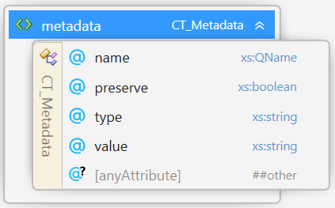

##### Attributes
| Name | Type | Use | Default | Annotation |
| --- | --- | --- | --- | --- |
| name | **xs:QName** | required | | Contains either the well-known name of the metadata defined by this specification (see Table 3-1 below) or vendor-defined metadata, which MUST be prefixed with a valid XML namespace name declared on the \<model> element. |
| preserve | **xs:boolean** | | | A non-zero value indicates the producer wants the consumer to preserve this value when it saves a modified version of this 3MF |
| type | **xs:string** | | | A string indicating the XML type of the data stored in the metadata value. |
| @anyAttribute | | | | |

Producers of 3MF Documents SHOULD provide additional information about the document in the form of metadata under the root \<model> element.

Metadata associated with the \<model> MAY contain a set of well known values. Metadata in 3MF Documents without a namespace name MUST be restricted to names and values defined by this specification. If a name value is not defined in this specification, it MUST be prefixed with the namespace name of an XML namespace declaration on the \<model> element that is not drawn from the default namespace.

The well-known metadata names and values defined by this specification include:

_Table 3-1. Metadata values_

| **Context** | **Name** | **Comment** |
| --- | --- | --- |
| Model | Title | A title for the 3MF document |
| | Designer | A name for a designer of this document |
| | Description |A description of the document |
| | Copyright | A copyright associated with this document |
| | LicenseTerms | License information associated with this document |
| | Rating | An industry rating associated with this document |
| | CreationDate | The date this documented was created by a source app |
| | ModificationDate | The date this document was last modified |
| | Application | The name of the source application that originally created this document |


The optional "type" attribute allows for the value to be any data. The default value for type is assumed to be "xs:string". If type is not present, The value of the \<metadata> value is assumed to be be any string. However, if type is specified, it MUST contain the name of a built-in Simple XML type representing the data contained in the value.

Simple XML types include any built-in primitive or derived XML types specified by the "xs:anySimpleType".

Producers MUST NOT create multiple metadata elements with the same name. A Producer that wishes to interoperate with other Consumers SHOULD publish a namespace URI and a set of well-defined metadata names and expected content in order for Consumers to function in an expected fashion.

Consumers SHOULD ignore any metadata with a name they do not recognize, typically from a future version of this specification or an unrecognized producer or target consumer.

Producers MAY indicate that certain metadata values should be preserved using the preserve attribute. The default value is assumed to be 0 or false. When the preserve attribute is 1 or true, Consumers that modify the 3MF file SHOULD retain the original metadata value even if the data it references is modified. The metadata should be preserved through the lifetime of the element it is associated with. If an \<Item> is removed, for example, the associated metadata should be removed with it.

[Appendix B.2.](#appendix-b2-3mf-metadata-example) includes a sample 3MF supporting custom metadata.


### 3.4.2. Resources

Element **\<resources>**

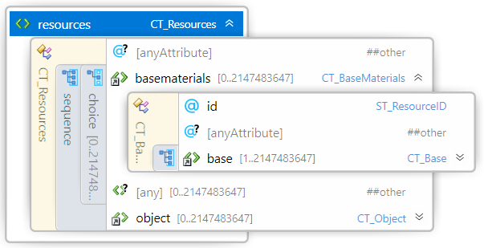

The \<resources> element acts as the root element of a library of constituent pieces of the overall 3D object definition. Objects, properties and materials are collectively referred to as _resources_ in this specification.

Each resource might rely on other resources for its complete definition. For example, an object resource may refer to material resources, or even other object resources to fully describe a 3D object.

An object resource represents a single 3D object that could be manufactured, but not necessarily will be manufactured. The objects that actually will be manufactured are referenced from an \<item> element child of the \<build> element. Objects are defined as resources primarily to aid in modularizing design and re-use of component, thus compacting the overall markup size.

Resource IDs MUST be unique within the model.


### 3.4.3. Build Instructions

Element **\<build>**


The \<build> element contains one or more items to manufacture as part of processing the job. A consumer MUST NOT output any 3D objects not referenced by an \<item> element.


#### 3.4.3.1. Item Element

Element **\<item>**

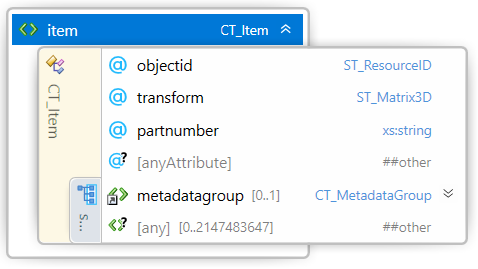

##### Attributes
| Name | Type | Use | Default | Annotation |
| --- | --- | --- | --- | --- |
| objectid | **ST\_ResourceID** | required | | Reference to the \<object> element with the matching id attribute value |
| transform | **ST\_Matrix3D** | | | A matrix transform (see [3.3. 3D Matrices](#33-3d-matrices)) applied to the item to be outputted. |
| partnumber | **xs:string** | | | A unique identifier for the item. SHOULD be maintained by an editor if only the transformation is changed. |
| @anyAttribute | | | | |

##### Elements
| Name | Type | Use | Default | Annotation |
| --- | --- | --- | --- | --- |
| metadatagroup | **CT\_MetadataGroup** | | | An optional group of CT\_Metadata elements as specified in the Metadata section of model. |

The \<item> element identifies one object resource to be output by the 3D manufacturing device. A consumer MUST apply the transform prior to outputting the object.

The \<item> element may contain a \<metadatagroup> element containing one or more vendor-supplied \<metadata> elements.

A 3MF Document may include multiple objects to manufacture at the same time. The arrangement of these items in the build is considered a default; consumers MAY rearrange the items for manufacturing in order to better pack the build volume. Sometimes objects are arranged in the coordinate space so as to be manufactured in an interlocking fashion; producers of these objects SHOULD collect them as components (see [4.2. Components](#42-components)), as 3D manufacturing devices MUST NOT transform components of an object relative to each other.

If the items overlap, 3D manufacturing devices MUST use the Positive fill rule (described in section 4.1.1) to resolve the ambiguity on the final geometry. If any of the overlapped items has a property defined, the resulting property on the overlapped volume is taken from the properties of the last overlapped item. If the last item has no properties defined in the overlapped volume, properties MUST NOT be applied.

>**Note:** items MUST NOT reference objects of type "other", either directly or recursively.


# Chapter 4. Object Resources

_Object resources_ describe reusable objects that may be output (by reference) or composed into more complex objects or assemblies.

Element **\<object>**

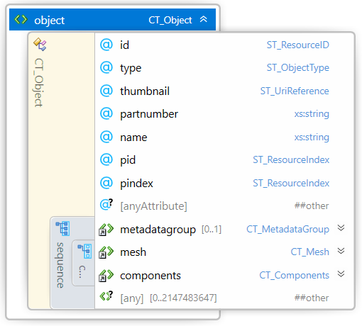

##### Attributes
| Name | Type | Use | Default | Annotation |
| --- | --- | --- | --- | --- |
| id | **ST\_ResourceID** | required | | Defines the unique identifier for this object. |
| type | **ST\_ObjectType** | | model | Specifies the function of the object in the model. Valid values are "model", "solidsupport", "support", "surface", or "other". A consumer MAY ignore support objects if they are not needed. The consumer MAY generate its own support objects in place of the provided support objects, but this is NOT RECOMMENDED. |
| thumbnail | **ST\_UriReference** | | | Path to an Object Thumbnail of type JPEG or PNG that represents a rendered image of the object. |
| partnumber | **xs:string** | | | Part number, which editors SHOULD maintain during the process of modifying and deriving objects. |
| name | **xs:string** | | | Name of object to improve readability. |
| pid | **ST\_ResourceID** | | | Reference to the property group element with the matching id attribute value (e.g. \<basematerials>). It is REQUIRED if pindex is specified. |
| pindex | **ST\_ResourceIndex** | | | References a zero-based index into the properties group specified by pid. This property is used to build the object. |
| @anyAttribute | | | | |

##### Elements
| Name | Type | Use | Default | Annotation |
| --- | --- | --- | --- | --- |
| metadatagroup | **CT\_MetadataGroup** | | | An optional group of CT\_Metadata elements as specified in the Metadata section of Model. |

An object resource is defined by an \<object> element. An \<object> element has attributes for the property group and specific property member that are to be applied to the entire object, except where overridden by a descendant element, such as a \<triangle> element or a component-referenced \<object> element. If this object contains any triangles with assigned properties, the object MUST specify pid and pindex, to act as default values for any triangles with unspecified properties. If no properties are assigned at all, the choice for the properties of the object is left to the consumer.

The object type is ignored on objects that contain components, since the type is always overridden by descendant objects. Producers MUST NOT assign pid or pindex attributes to objects that contain components. This ensures that an object with no material will not be split into two representations with different materials due to being referenced as a component in multiple objects.

Object Thumbnails MUST have an appropriate thumbnail relationship to the model part as described in section 2.1.1. Consumers MAY find additional thumbnails associated with an object by the 3D Texture relationship, for backwards compatibility. Producers MUST store thumbnails with the thumbnail relationship in an associated object thumbnail part.

Part numbers are intended as a way to keep track of objects which may have been modified during a tool chain. When editing or processing a 3MF document, these part numbers SHOULD be preserved to the greatest degree possible, duplicating them for objects split into pieces, removing them from objects that are combined, and maintaining them for objects that are modified.


## 4.1. Meshes

Element **\<mesh>**

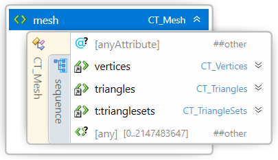

The \<mesh> element is the root of a triangular _mesh_ representation of an object volume. It contains a set of vertices and a set of triangles.

If the mesh is under an object of type "model" or "solidsupport", it MUST have:

- Manifold Edges: Every triangle edge in the mesh shares common vertex endpoints with the edge of exactly 1 other triangle.
- Consistent Triangle Orientation: Every pair of adjacent triangles within the mesh MUST have the same orientation of the face normal toward the exterior of the mesh, meaning that the order of declaration of the vertices on the shared edge MUST be in the opposite order. For example, if Triangle1 has vertices ABC and Triangle2 has vertices DEF and Triangle1 and Triangle2 share the AB/DE edge, then it MUST be the case that vertices A=E and vertices B=D (see figure 4-1 below). A triangle face normal (for triangle ABC, in that order) throughout this specification is defined as a unit vector in the direction of the vector cross product (B - A) x (C - A). For example, the triangles shown in figure 4-1 have normals pointing out of the mesh.
- Outward-facing normals: All triangles MUST be oriented with normals that point away from the interior of the object. Meshes with negative volume will not be printed (or will become voids), in accordance with the Positive fill rule defined in the next section. In combination with the preceding two rules, a mesh is therefore a continuous surface without holes, gaps, open edges, or non-orientable surfaces (e.g. Klein bottle).

_Figure 4-1. Consistent triangle orientation_


Objects of type "support", "surface" and "other" are allowed to break these conditions. Objects of type "other" MUST NOT be referenced in the Build section, either recursively or directly.

All meshes SHOULD have:

- Minimal self-intersections: Producers SHOULD NOT produce self-intersections or overlapping objects; consumers MUST accept self-intersecting meshes and overlapping objects, but treat "model" and "solidsupport" types as if filled with a Positive fill rule (see next section).
- Non-degeneracy: All triangles SHOULD have a non-zero area, as this will create numerical instabilities while calculating the triangle normal.

Manufacturing devices MAY fill objects of type "model" or "solidsupport" either with solid material or an internal structure, possibly as specified in the print ticket. If the object is of type "support" the manufacturing device may decide - possibly taking into account print ticket parameters - the actual representation (e.g thickness) of the support. In any case, the manufacturing device MUST NOT fill this mesh.

Objects of type "support" or "solidsupport" SHOULD only be referenced in an Object containing one or more components with type "model" they are supporting.

Support structures (both "solidsupport" and "support" types) MAY be ignored or replaced by auto-generated support, but this is NOT RECOMMENDED.


### 4.1.1. Fill Rule

Because meshes may overlap or self-intersect, a _fill rule_ must be specified to indicate what enclosed areas are "inside" the volume and which are "outside" the volume. The enclosed volume of a group of meshes is defined by applying the fill algorithm. Fill algorithms determine how the intersecting areas of geometric shapes are combined to form a region. A fill rule is defined identically in 2D as in 3D, so the examples here will show the 2D equivalent for simplicity of figures. Consumers MAY take advantage of this fact by applying the fill rule after slicing, thereby simplifying the algorithm by only having to operate in 2D. By convention, a 2D figure has positive area when wound counter-clockwise, so when looking along an edge, the local "outside" is to the right, equivalent to the local "outside" of a triangle being the direction of the normal.

In 3MF, the fill rule applied is always the Positive fill rule, which determines the "insideness" of a point by drawing a ray from the point to infinity in any direction and then examining the places where it crosses the shape. Starting with a count of zero, add one each time the ray passes from the local "inside" to the local "outside" and subtract one for vice-versa. After counting the crossings, if the result is one or greater, then the point is globally inside the volume; otherwise, it is outside.

_Figure 4-2. Fill using Positive algorithm_

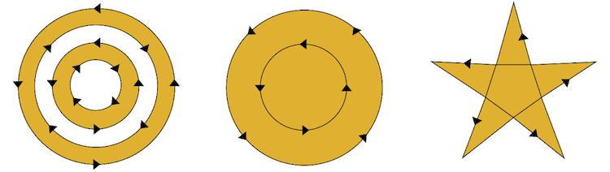


### 4.1.2. Overlapping order

Because a mesh may overlap to itself, an _overlapping order_ must be specified to indicate which properties of the overlapping surface apply.

When two triangles on the mesh surface overlap each other, the properties of the overlapped area are taken from the properties of the last overlapping triangle. If no properties are defined in the last overlapped triangle, properties SHOULD NOT be applied to the overlapped area of the triangle. To avoid this, 3MF producers SHOULD NOT create overlapping triangles.


### 4.1.3. Vertices

Element **\<vertices>**

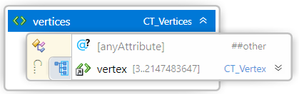

The vertices element contains all the \<vertex> elements for this object. The vertices represent the corners of each triangle in the mesh. The order of these elements defines an implicit 0-based index that is referenced by other elements, such as the \<triangle> element. The producer SHOULD NOT include duplicate vertices unless coalescing duplicates would create non-manifold edges. Furthermore, a producer SHOULD collapse vertices that are very closely proximal with a single vertex whenever appropriate. In order to avoid integer overflows, a vertex array MUST contain less than 2^31 vertices.


#### 4.1.3.1. Vertex

Element **\<vertex>**


##### Attributes
| Name | Type | Use | Default | Annotation |
| --- | --- | --- | --- | --- |
| x | **ST\_Number** | required | | The position of the vertex along the X axis. |
| y | **ST\_Number** | required | | The position of the vertex along the Y axis. |
| z | **ST\_Number** | required | | The position of the vertex along the Z axis. |
| @anyAttribute | | | | |

A \<vertex> element represents a point in 3-dimensional space that is referenced by a triangle in the mesh. The decimal values representing the coordinates can be recorded to arbitrary precision. Producers SHOULD NOT use more precision than the error generated in their calculations, or the anticipated resolution of their consumer. The variable-precision nature of ASCII encoding is a significant advantage over fixed-width binary formats, and helps make up the difference in storage efficiency.


### 4.1.4. Triangles

Element **\<triangles>**

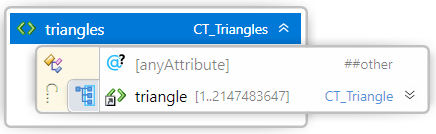

The \<triangles> element contains a set of 1 or more \<triangle> elements to describe a full 3D object mesh. If the object type is "model", the mesh has to contain at least 4 triangles to form a solid body. In order to avoid integer overflows, a triangle array MUST contain less than 2^31 triangles.

These limitations can be superceded by another required 3MF extension.


#### 4.1.4.1. Triangle

Element **\<triangle>**

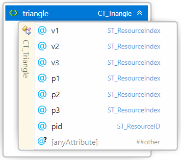

##### Attributes
| Name | Type | Use | Default | Annotation |
| --- | --- | --- | --- | --- |
| v1 | **ST\_ResourceIndex** | required | | References a zero-based index into the vertices for this mesh. Defines the first vertex of the triangle. |
| v2 | **ST\_ResourceIndex** | required | | References a zero-based index into the vertices for this mesh. Defines the second vertex of the triangle. |
| v3 | **ST\_ResourceIndex** | required | | References a zero-based index into the vertices for this mesh. Defines the third vertex of the triangle. |
| p1 | **ST\_ResourceIndex** | | | Overrides the object-level pindex for the first vertex of the triangle. |
| p2 | **ST\_ResourceIndex** | | | Overrides the object-level pindex for the second vertex of the triangle. |
| p3 | **ST\_ResourceIndex** | | | Overrides the object-level pindex for the third vertex of the triangle. |
| pid | **ST\_ResourceID** | | | Overrides the object-level pid for the triangle. |
| @anyAttribute | | | | |

A \<triangle> element represents a single face of the mesh. The order of the vertices (v1, v2, v3) MUST be specified in counter-clockwise order, such that the face normal of the triangle is pointing toward the outside of the object. The indices v1, v2 and v3 MUST be distinct.

The properties applied to each vertex (p1, p2, p3) allow property gradients to be defined across the triangle, where interpolation of the property is defined as the linear convex combination. A consumer that cannot create property gradients MUST apply the p1 property to the entire triangle. A consumer that cannot use properties on a per-triangle basis MUST ignore the triangle properties and use the \<object> level property instead. If p1 is not specified then the default object property, if specified, is assigned to the triangle. If p2 or p3 is unspecified then p1 is used for the entire triangle.

The property group is specified by the pid attribute, if different than the property group defined at the object-level. Since this is applied to the whole triangle, it implicitly forces the three properties to be from the same group, which implies they are of the same type, as defined by possible extensions to this spec.

If the properties defined on the triangle are from a \<basematerials> group (see [Chapter 5](#chapter-5-material-resources)), they MUST NOT form gradients, as interpolation of base materials is not defined in this core specification. Therefore p1, p2 and p3 MUST be equal or unspecified. Material gradients and interpolation methods are defined in extension specifications.

>**Note:** The triangle orientation is affected by the sign of the determinant of the transformation as described in Section 4.1.


## 4.2. Components

Element **\<components>**


The \<components> element acts as a container for all components to be composed into the current object. A _component_ is an object resource that is used in the context of another object definition. Through the use of components, a producer can reduce the overall size of the 3MF Document. For example, if the 3MF Document describes a car 3D object, there may be a car object resource that uses 1 auto body component instance and 4 component instances of tire object resources, to place the wheels on the car's body object after applying the necessary rotation and translation (via transform).

A 3D manufacturing device MUST respect the relative positions of the component objects; it MUST NOT transform them relative to each other except as specified in the document.

If the components overlap, 3D manufacturing devices MUST use the Positive fill rule (described in section 4.1.1) to resolve the ambiguity on the final geometry. If any of the overlapped components has a property defined, the resulting property on the overlapped volume is taken from the properties of the last overlapped component. If the last component has no properties defined in the overlapped volume, properties MUST NOT be applied.

In order to avoid integer overflows, a components element MUST contain less than 2^31 components.


### 4.2.1. Component

Element **\<component>**

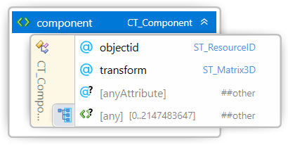

##### Attributes
| Name | Type | Use | Default | Annotation |
| --- | --- | --- | --- | --- |
| objectid | **ST\_ResourceID** | required | | References an object resource with a matching id attribute value. |
| transform | **ST\_Matrix3D** | | | A matrix transform (see [3.3. 3D Matrices](#33-3d-matrices)) applied to the item to be outputted. |
| @anyAttribute | | | | |

A component selects a pre-defined object resource and adds it to the current object definition, after applying the provided matrix transform. This composition of an object definition from multiple primitive components can provide a very compact file size for a quite complex model. In keeping with the use of a simple parser, producers MUST define objects prior to referencing them as components.


# Chapter 5. Material Resources

Element **\<basematerials>**

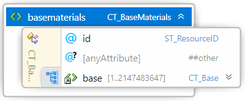

##### Attributes
| Name | Type | Use | Default | Annotation |
| --- | --- | --- | --- | --- |
| id | **ST\_ResourceID** | required | | Unique ID among all materials groups (which could include elements from extensions to the spec). |
| @anyAttribute | | | | |

A \<basematerials> element is a material group that acts as a container for the base materials. The order of these elements forms an implicit 0-based index that is referenced by other elements, such as the \<object> and \<triangle> elements. Other types of property group elements can be added as extensions to this spec, due to the \<any> element under resources. Each property group so defined MUST include an ID, and the IDs MUST be unique among all resources under Model. These groups allow different types of properties to be separated and organized, given the many possible extensions.

In order to avoid integer overflows, a material group MUST contain less than 2^31 materials.


## 5.1. Base Material

Element **\<base>**

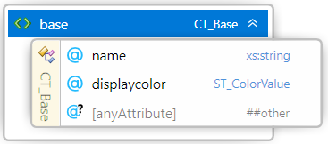

##### Attributes
| Name | Type | Use | Default | Annotation |
| --- | --- | --- | --- | --- |
| name | **xs:string** | required | | Specifies the material name, intended to convey design intent, for the purpose of aiding users in mapping to print materials. |
| displaycolor | **ST\_ColorValue** | required | | Specifies the sRGB color for rendering the material. |
| @anyAttribute | | | | |

A _base material_ is used to define the specific _material_ to be used for manufacturing certain objects in a model. In particular, support objects are often built from a different material than the non-sacrificial portion of the model.

Since these materials can be applied at both the object and triangle level, they are technically only specifying the material at the surface of the object. Consumers may choose how the materials are distributed through the volume, so long as the surfaces have the specified materials.

Base material names are intended to convey design intent and producers SHOULD avoid machine-specific naming in favor of more portable descriptions. Printer-specific information is intended to live in the Print Ticket, which includes a mapping from these base materials to actual printer materials. Base material names SHOULD be unique throughout the 3MF package.

>**Note:** The _displaycolor_ property is meant to be used for rendering purposes only, and not for defining the actual material color of an object. A producer MUST NOT assume that _displaycolor_ has any effect on the printed part.

For specifying the color design intent for a printed part, a producer MUST specify color properties via the material and property extension or use another corresponding extension.


### 5.1.1. sRGB Color

An sRGB color MUST be specified with a value of a 6 or 8 digit hexadecimal number, e.g. "#RRGGBB" or "#RRGGBBAA" where RR is the red channel with values from 00-FF, GG is the green channel with values from 00-FF, BB is the blue channel with values from 00-FF, and AA is the alpha channel with values from 00 (completely transparent) to FF (completely opaque, the default if not specified).

>**Note:** 3MF uses sRGB as specified by the World Wide Web Consortium (http://www.w3.org/Graphics/Color/sRGB)


# Chapter 6. 3MF Document Package Features

3MF Documents take advantage of parts defined by the Open Packaging Conventions to provide additional information about the content in the package.


## 6.1. Package Thumbnail and Object Thumbnail

The producer of a 3MF document MAY include a 2D _thumbnail_ image representing the contents of the 3D payload or of specific objects within the 3D payload. This image may be of content type image/jpeg or image/png, following the internal file format requirements described in the following subsections.

The package thumbnail has a relationship from the package root to the thumbnail image, object thumbnails have a relationship from the 3D Model part to the thumbnail image. The relationship type MUST be:

http://schemas.openxmlformats.org/package/2006/relationships/metadata/thumbnail

The thumbnail can be accessed and displayed by external systems, such as the operating system's file explorer, a model browser, or a print queue preview utility.


### 6.1.1. JPEG Images

JPEG image parts MUST contain images that conform to the JPEG specification. Consumers SHOULD support JPEG images that contain APP0, APP2, APP13, and APP14 markers. Consumers MUST support JPEG images that contain the APP1 marker and interpret the EXIF color space correctly.

_Table 6-1. Supported JPEG APPn markers_

| **APPn Marker** | **Originating source** |
| --- | --- |
| APP0 | JFIF specification |
| APP1 | EXIF extension defined by JEITA |
| APP2 | ICC profile marker defined by the ICC specification |
| APP13 | Photoshop 3.0 extension |
| APP14 | Adobe DCT Filters in PostScript Level 2 extension |

CMYK JPEG images MUST NOT be used.

>**Note:** If both APP2 and APP13 markers are specified, the APP2 marker takes precedence.


### 6.1.2. PNG Images

PNG image parts MUST contain images that conform to the PNG specification.

_Table 6-2. Support for ancillary PNG chunks_

| **Chunk** | **Support Level** |
| --- | --- |
| tRNS | MUST Support |
| iCCP | MUST Support |
| sRGB | MUST Ignore |
| cHRM | MUST Ignore |
| gAMA | MUST Ignore |
| sBIT | MUST Ignore |


## 6.2. Core Properties

The 3MF Document format relies on the _Core Properties_ part, defined in the Open Packaging Conventions specification, to provide metadata about the creation time, modification time, author, search keywords, and other document-centric metadata. See the Open Packaging Conventions specification for additional details.


## 6.3. Digital Signatures

3MF Documents may contain one or more _digital signatures_. A digital signature provides a mechanism to verify that a 3MF Document has not been tampered with since it was signed. The absence of a digital signature cannot prove that a 3MF Document was never signed.

The Open Packaging Conventions specification provides full details of how digital signatures are applied in OPC packages. The Digital Signature Origin part acts as the root of the digital signature payload in the 3MF Document. Individual Digital Signature parts can be discovered via relationship from the Digital Signature Origin part. Each Digital Signature part can have either an inline digital certificate, or a reference to an external Digital Signature Certificate part in the package.

A digital signature applied to the 3D Model part SHOULD include only the 3D Model part and any other parts referenced by it, along with the associated relationships. It MAY include the Package Thumbnail, Digital Signature Origin, Core Properties parts and associated relationship parts.


### 6.3.1. Normalization

Before applying or verifying a digital signature on the contents of the 3D Model part, the XML therein MUST first be normalized, which is equivalent to XML canonicalization according to XML C14N requirements.


## 6.4. Protected Content

This specification does not include any content protection mechanism of its own. However, it is recognized that for some workflows (e.g. those where a 3MF Document is stored as a stand-alone file), it is important to prevent an intercepting party from accessing 3D object details as they travel from the point of production or distribution through to the point of intended consumption on an authorized device or by an authorized application or user.

The Open Packaging Conventions specification provides full details of how content is protected in OPC packages.

A consumer that is authorized to un-protect content by reversing the above steps MUST NOT re-save the content or enable the user to save the content in an unprotected fashion (regardless of file format) without the approval (written or programmatic) of the _protection authority_ (which might or might not be the producer).

# Part II. Appendixes

## Appendix A. Glossary

**3D matrix.** A 4x4 affine matrix used for rotating, scaling, and translating an object in three-dimensional space.

**3D model.** The markup that defines a model for output.

**3D Model part.** The OPC part that contains a 3D model.

**3D Texture part.** A file used to apply complex information to a 3D object in the 3D Model part (undefined in this specification, but available for extensions to this specification).

**3MF.** The 3D Manufacturing Format described by this specification, defining one or more 3D objects intended for output to a physical form.

**3MF Document.** The digital manifestation of an OPC package that contains a 3D payload that conforms with the 3MF specification.

**3MF Document StartPart relationship.** The OPC relationship from the root of the package to the 3D Model part.

**Assembly.** A model that contains two or more independently-defined objects that are connected or interlocked either during or after the 3D manufacturing process is complete. An assembly might be able to be reversed or the individual parts may be inseparably interlocked.

**Back.** The maximum printable XZ plane of the print area or the correspondent maximum plane of a model bounding box, once transformed to the output coordinate space.

**Bottom.** The minimum printable XY plane of the print area or the correspondent minimum plane of a model bounding box, once transformed to the output coordinate space.

**Component.** An object that is added as an intact shape to the overall definition of another object.

**Consumer.** A software, service, or device that reads in a 3MF Document.

**Core properties.** The well-defined set package (OPC) properties that define metadata about the package as a whole, such as the author, the last modified time, and so on.

**Digital signatures.** A mechanism that, when present, can be used to validate that a part or payload has not been tampered with or changed since the digital signature was applied.

**Editor.** A software, service, or device that both reads in and writes out 3MF Documents, possibly changing the content in between.

**Fill rule.** The algorithm used to determine whether any particular point is considered to be "inside" the geometry or not.

**Front.** The minimum printable XZ plane of the print area or the correspondent minimum plane of a model bounding box, once transformed to the output coordinate space.

**Left.** The minimum printable YZ plane of the print area or the correspondent minimum plane of a model bounding box, once transformed to the output coordinate space.

**Material.** The description of a physical substance that can be used to output an object.

**Material resource.** A potential resource that might be referenced by an object to describe what the object will be made of.

**Mesh.** A triangular tessellation of an object's surface.

**Metadata.** Ancillary information about some portion of the model, to provide more refined processing by knowledgeable producers or consumers.

**Model.** The set of objects that are to be manufactured as part of a single job. This may include a single object, multiple instances of the same object, multiple different objects, or multiple objects in an assembly.

**Must preserve.** A set of OPC parts that SHOULD be retained by a producer when rewriting or saving changes to this 3MF file specified by the MustPreserve relationship type.

**Object resource.** A single 3D shape that could be output by a 3D manufacturing device or used as a component in another object resource.

**Payload.** A complete collection of interdependent parts and relationships within a package.

**PrintTicket.** The contents of a PrintTicket part. Conforms to the Print Schema Specification. It is RECOMMENDED to use the standard Print Schema Keywords for 3D Manufacturing when possible.

**PrintTicket part.** The PrintTicket part provides settings used when the 3MF Document is printed.

**Primary 3D payload root.** The 3D payload discovered by the 3MF Document StartPart relationship.

**Producer.** A software, service, or device that writes out a 3MF Document.

**Protection authority.** The owner of the protection mechanism described by the protection type. This may be the producer that originally protected the file, the consumer that defines what protection mechanism will be accepted, or a third-party protection service, such as a digital rights management service.

**Protection namespace.** The XML namespace that the protection type and associated metadata are drawn from. It is declared on the \<model> element.

**Protection type.** The qualified name for a protection mechanism that has been applied to the resources and textures of the 3MF Document. This could be as simple as an XOR obfuscation or as complex as a full digital rights management solution. The valid protection types are not defined in this specification and are implementation dependent.

**Resource.** An object, material, or something else defined in an extension that could be used by another resource or might be necessary to build a physical 3D object according to build instructions.

**Right.** The maximum printable YZ plane of the print area or the correspondent maximum plane of a model bounding box, once transformed to the output coordinate space.

**Support.** Many 3D printers require scaffolding for overhanging areas in the model to keep them from collapsing or warping; this scaffolding is referred to as support.

**Thumbnail.** An image that helps end-users identify the contents of the package, expressed as a JPEG or PNG image.

**Thumbnail part.** The OPC part that contains the package thumbnail image or the object thumbnail image.

**Top.** The maximum printable XY plane of the print area or the correspondent maximum plane of a model bounding box, once transformed to the output coordinate space.

**XML namespace.** A namespace declared on the \<model> element, in accordance with the XML Namespaces specification.

## Appendix B.1. 3MF XSD Schema

```xml
<?xml version="1.0" encoding="UTF-8"?>
<xs:schema xmlns="http://schemas.microsoft.com/3dmanufacturing/core/2015/02"
	xmlns:xs="http://www.w3.org/2001/XMLSchema" xmlns:xml="http://www.w3.org/XML/1998/namespace"
	targetNamespace="http://schemas.microsoft.com/3dmanufacturing/core/2015/02"
	elementFormDefault="unqualified" attributeFormDefault="unqualified" blockDefault="#all">
	<!-- Import xml: namespace -->
	<xs:import namespace="http://www.w3.org/XML/1998/namespace"
		schemaLocation="http://www.w3.org/2001/xml.xsd"/>

	<xs:annotation>
		<xs:documentation><![CDATA[
		Schema notes:

		Items within this schema follow a simple naming convention of appending a prefix indicating the type of element for references:

		Unprefixed: Element names
		CT_: Complex types
		ST_: Simple types
		
		]]></xs:documentation>
	</xs:annotation>
	<!-- Complex Types -->
	<xs:complexType name="CT_Model">
		<xs:sequence>
			<xs:element ref="metadata" minOccurs="0" maxOccurs="2147483647"/>
			<xs:element ref="resources"/>
			<xs:element ref="build"/>
			<xs:any namespace="##other" processContents="lax" minOccurs="0" maxOccurs="2147483647"/>
		</xs:sequence>
		<xs:attribute name="unit" type="ST_Unit" default="millimeter"/>
		<xs:attribute ref="xml:lang"/>
		<xs:attribute name="requiredextensions" type="xs:string"/>
		<xs:anyAttribute namespace="##other" processContents="lax"/>
	</xs:complexType>
	<xs:complexType name="CT_Resources">
		<xs:sequence>
			<xs:choice minOccurs="0" maxOccurs="2147483647">
				<xs:element ref="basematerials" minOccurs="0" maxOccurs="2147483647"/>
				<xs:any namespace="##other" processContents="lax" minOccurs="0" maxOccurs="2147483647"/>
			</xs:choice>
			<xs:element ref="object" minOccurs="0" maxOccurs="2147483647"/>
		</xs:sequence>
		<xs:anyAttribute namespace="##other" processContents="lax"/>
	</xs:complexType>
	<xs:complexType name="CT_Build">
		<xs:sequence>
			<xs:element ref="item" minOccurs="0" maxOccurs="2147483647"/>
		</xs:sequence>
		<xs:anyAttribute namespace="##other" processContents="lax"/>
	</xs:complexType>
	<xs:complexType name="CT_BaseMaterials">
		<xs:sequence>
			<xs:element ref="base" maxOccurs="2147483647"/>
		</xs:sequence>
		<xs:attribute name="id" type="ST_ResourceID" use="required"/>
		<xs:anyAttribute namespace="##other" processContents="lax"/>
	</xs:complexType>
	<xs:complexType name="CT_Base">
		<xs:attribute name="name" type="xs:string" use="required"/>
		<xs:attribute name="displaycolor" type="ST_ColorValue" use="required"/>
		<xs:anyAttribute namespace="##other" processContents="lax"/>
	</xs:complexType>
	<xs:complexType name="CT_MetadataGroup">
		<xs:sequence>
			<xs:element ref="metadata" maxOccurs="2147483647"/>
		</xs:sequence>
		<xs:anyAttribute namespace="##other" processContents="lax"/>
	</xs:complexType>
	<xs:complexType name="CT_Object">
		<xs:sequence>
			<xs:element ref="metadatagroup" minOccurs="0" maxOccurs="1"/>
			<xs:choice>
				<xs:element ref="mesh"/>
				<xs:element ref="components"/>
			</xs:choice>
			<xs:any namespace="##other" processContents="lax" minOccurs="0" maxOccurs="2147483647"/>
		</xs:sequence>
		<xs:attribute name="id" type="ST_ResourceID" use="required"/>
		<xs:attribute name="type" type="ST_ObjectType" default="model"/>
		<xs:attribute name="thumbnail" type="ST_UriReference"/>
		<xs:attribute name="partnumber" type="xs:string"/>
		<xs:attribute name="name" type="xs:string"/>
		<xs:attribute name="pid" type="ST_ResourceIndex"/>
		<xs:attribute name="pindex" type="ST_ResourceIndex"/>
		<xs:anyAttribute namespace="##other" processContents="lax"/>
	</xs:complexType>
	<xs:complexType name="CT_Mesh">
		<xs:sequence>
			<xs:element ref="vertices"/>
			<xs:element ref="triangles"/>
			<xs:any namespace="##other" processContents="lax" minOccurs="0" maxOccurs="2147483647"/>
		</xs:sequence>
		<xs:anyAttribute namespace="##other" processContents="lax"/>
	</xs:complexType>
	<xs:complexType name="CT_Vertices">
		<xs:sequence>
			<xs:element ref="vertex" minOccurs="3" maxOccurs="2147483647"/>
		</xs:sequence>
		<xs:anyAttribute namespace="##other" processContents="lax"/>
	</xs:complexType>
	<xs:complexType name="CT_Vertex">
		<xs:attribute name="x" type="ST_Number" use="required"/>
		<xs:attribute name="y" type="ST_Number" use="required"/>
		<xs:attribute name="z" type="ST_Number" use="required"/>
		<xs:anyAttribute namespace="##other" processContents="lax"/>
	</xs:complexType>
	<xs:complexType name="CT_Triangles">
		<xs:sequence>
			<xs:element ref="triangle" minOccurs="1" maxOccurs="2147483647"/>
		</xs:sequence>
		<xs:anyAttribute namespace="##other" processContents="lax"/>
	</xs:complexType>
	<xs:complexType name="CT_Triangle">
		<xs:attribute name="v1" type="ST_ResourceIndex" use="required"/>
		<xs:attribute name="v2" type="ST_ResourceIndex" use="required"/>
		<xs:attribute name="v3" type="ST_ResourceIndex" use="required"/>
		<xs:attribute name="p1" type="ST_ResourceIndex"/>
		<xs:attribute name="p2" type="ST_ResourceIndex"/>
		<xs:attribute name="p3" type="ST_ResourceIndex"/>
		<xs:attribute name="pid" type="ST_ResourceID"/>
		<xs:anyAttribute namespace="##other" processContents="lax"/>
	</xs:complexType>
	<xs:complexType name="CT_Components">
		<xs:sequence>
			<xs:element ref="component" maxOccurs="2147483647"/>
		</xs:sequence>
		<xs:anyAttribute namespace="##other" processContents="lax"/>
	</xs:complexType>
	<xs:complexType name="CT_Component">
		<xs:sequence>
			<xs:any namespace="##other" processContents="lax" minOccurs="0" maxOccurs="2147483647"/>
		</xs:sequence>
		<xs:attribute name="objectid" type="ST_ResourceID" use="required"/>
		<xs:attribute name="transform" type="ST_Matrix3D"/>
		<xs:anyAttribute namespace="##other" processContents="lax"/>
	</xs:complexType>
	<xs:complexType name="CT_Metadata" mixed="true">
		<xs:attribute name="name" type="xs:QName" use="required"/>
		<xs:attribute name="preserve" type="xs:boolean" use="optional"/>
		<xs:attribute name="type" type="xs:string" use="optional"/>
		<xs:anyAttribute namespace="##other" processContents="lax"/>
	</xs:complexType>
	<xs:complexType name="CT_Item">
		<xs:sequence>
			<xs:element ref="metadatagroup" minOccurs="0" maxOccurs="1"/>
			<xs:any namespace="##other" processContents="lax" minOccurs="0" maxOccurs="2147483647"/>
		</xs:sequence>
		<xs:attribute name="objectid" type="ST_ResourceID" use="required"/>
		<xs:attribute name="transform" type="ST_Matrix3D"/>
		<xs:attribute name="partnumber" type="xs:string"/>
		<xs:anyAttribute namespace="##other" processContents="lax"/>
	</xs:complexType>
	<!-- Simple Types -->
	<xs:simpleType name="ST_Unit">
		<xs:restriction base="xs:string">
			<xs:enumeration value="micron"/>
			<xs:enumeration value="millimeter"/>
			<xs:enumeration value="centimeter"/>
			<xs:enumeration value="inch"/>
			<xs:enumeration value="foot"/>
			<xs:enumeration value="meter"/>
		</xs:restriction>
	</xs:simpleType>
	<xs:simpleType name="ST_ColorValue">
		<xs:restriction base="xs:string">
			<xs:pattern value="#[0-9|A-F|a-f][0-9|A-F|a-f][0-9|A-F|a-f][0-9|A-F|a-f][0-9|A-F|a-f][0-9|A-F|a-f]([0-9|A-F|a-f][0-9|A-F|a-f])?"/>
		</xs:restriction>
	</xs:simpleType>
	<xs:simpleType name="ST_UriReference">
		<xs:restriction base="xs:anyURI">
			<xs:pattern value="/.*"/>
		</xs:restriction>
	</xs:simpleType>
	<xs:simpleType name="ST_Matrix3D">
		<xs:restriction base="xs:string">
			<xs:whiteSpace value="collapse"/>
			<xs:pattern value="((\-|\+)?(([0-9]+(\.[0-9]+)?)|(\.[0-9]+))((e|E)(\-|\+)?[0-9]+)?) ((\-|\+)?(([0-9]+(\.[0-9]+)?)|(\.[0-9]+))((e|E)(\-|\+)?[0-9]+)?) ((\-|\+)?(([0-9]+(\.[0-9]+)?)|(\.[0-9]+))((e|E)(\-|\+)?[0-9]+)?) ((\-|\+)?(([0-9]+(\.[0-9]+)?)|(\.[0-9]+))((e|E)(\-|\+)?[0-9]+)?) ((\-|\+)?(([0-9]+(\.[0-9]+)?)|(\.[0-9]+))((e|E)(\-|\+)?[0-9]+)?) ((\-|\+)?(([0-9]+(\.[0-9]+)?)|(\.[0-9]+))((e|E)(\-|\+)?[0-9]+)?) ((\-|\+)?(([0-9]+(\.[0-9]+)?)|(\.[0-9]+))((e|E)(\-|\+)?[0-9]+)?) ((\-|\+)?(([0-9]+(\.[0-9]+)?)|(\.[0-9]+))((e|E)(\-|\+)?[0-9]+)?) ((\-|\+)?(([0-9]+(\.[0-9]+)?)|(\.[0-9]+))((e|E)(\-|\+)?[0-9]+)?) ((\-|\+)?(([0-9]+(\.[0-9]+)?)|(\.[0-9]+))((e|E)(\-|\+)?[0-9]+)?) ((\-|\+)?(([0-9]+(\.[0-9]+)?)|(\.[0-9]+))((e|E)(\-|\+)?[0-9]+)?) ((\-|\+)?(([0-9]+(\.[0-9]+)?)|(\.[0-9]+))((e|E)(\-|\+)?[0-9]+)?)"/>
		</xs:restriction>
	</xs:simpleType>
	<xs:simpleType name="ST_Number">
		<xs:restriction base="xs:double">
			<xs:whiteSpace value="collapse"/>
			<xs:pattern value="((\-|\+)?(([0-9]+(\.[0-9]+)?)|(\.[0-9]+))((e|E)(\-|\+)?[0-9]+)?)"/>
		</xs:restriction>
	</xs:simpleType>
	<xs:simpleType name="ST_ResourceID">
		<xs:restriction base="xs:positiveInteger">
			<xs:maxExclusive value="2147483648"/>
		</xs:restriction>
	</xs:simpleType>
	<xs:simpleType name="ST_ResourceIndex">
		<xs:restriction base="xs:nonNegativeInteger">
			<xs:maxExclusive value="2147483648"/>
		</xs:restriction>
	</xs:simpleType>
	<xs:simpleType name="ST_ObjectType">
		<xs:restriction base="xs:string">
			<xs:enumeration value="model"/>
			<xs:enumeration value="solidsupport"/>
			<xs:enumeration value="support"/>
			<xs:enumeration value="surface"/>
			<xs:enumeration value="other"/>
		</xs:restriction>
	</xs:simpleType>
	<!-- Elements -->
	<xs:element name="metadatagroup" type="CT_MetadataGroup"/>
	<xs:element name="model" type="CT_Model"/>
	<xs:element name="resources" type="CT_Resources"/>
	<xs:element name="build" type="CT_Build"/>
	<xs:element name="basematerials" type="CT_BaseMaterials"/>
	<xs:element name="base" type="CT_Base"/>
	<xs:element name="object" type="CT_Object"/>
	<xs:element name="mesh" type="CT_Mesh"/>
	<xs:element name="vertices" type="CT_Vertices"/>
	<xs:element name="vertex" type="CT_Vertex"/>
	<xs:element name="triangles" type="CT_Triangles"/>
	<xs:element name="triangle" type="CT_Triangle"/>
	<xs:element name="components" type="CT_Components"/>
	<xs:element name="component" type="CT_Component"/>
	<xs:element name="metadata" type="CT_Metadata"/>
	<xs:element name="item" type="CT_Item"/>
</xs:schema>
```

## Appendix B.2. 3MF Metadata Example

```xml
<?xml version="1.0" encoding="UTF-8"?>
<model unit="millimeter" xml:lang="en-us" xmlns:m="http://schemas.microsoft.com/3dmanufacturing/material/2015/02" xmlns="http://schemas.microsoft.com/3dmanufacturing/core/2015/02" xmlns:vendor1="http://www.vendorwwebsite.com/3mf/vendor13mfextension/2017/01">
  <metadata name="Copyright">© Microsoft Corporation 2013</metadata>
  <metadata name="Application">Microsoft 3D Builder</metadata>
  <metadata name="LicenseTerms">All rights reserved</metadata>
  <metadata name="Title">Cube</metadata>
  <metadata name="Designer">Microsoft Corporation</metadata>
  <metadata name="CreationDate">2013-10-07</metadata>
  <metadata name="ModificationDate">2014-03-27</metadata>
  <metadata name="Description">Cube</metadata>
  <metadata name="vendor1:CustomMetadata1" preserve="1">CE8A91FB-C44E-4F00-B634-BAA411465F6A</metadata>
  <resources>
    <basematerials id="1">
      <base name="Green" displaycolor="#21BB4CFF" />
    </basematerials>
    <object id="2" type="model" pid="1" pindex="0">
    <metadatagroup>      
<metadata name="vendor1:CustomMetadata2" preserve="true" type="xs:string">03DAE6E4-24FF-4B20-97A1-7487AB9C1CB0</metadata>
</metadatagroup>
      <mesh>
        <vertices>
          <vertex x="0" y="42.998" z="39.998" />
          <vertex x="39.998" y="42.998" z="39.998" />
          <vertex x="0" y="82.998" z="39.998" />
          <vertex x="39.998" y="82.998" z="0" />
          <vertex x="0" y="42.998" z="0" />
          <vertex x="0" y="82.998" z="0" />
          <vertex x="39.998" y="42.998" z="0" />
          <vertex x="39.998" y="82.998" z="39.998" />
        </vertices>
        <triangles>
          <triangle v1="0" v2="1" v3="2" />
          <triangle v1="3" v2="4" v3="5" />
          <triangle v1="4" v2="3" v3="6" />
          <triangle v1="7" v2="2" v3="1" />
          <triangle v1="4" v2="6" v3="1" />
          <triangle v1="4" v2="2" v3="5" />
          <triangle v1="7" v2="1" v3="6" />
          <triangle v1="5" v2="2" v3="7" />
          <triangle v1="4" v2="0" v3="2" />
          <triangle v1="6" v2="3" v3="7" />
          <triangle v1="1" v2="0" v3="4" />
          <triangle v1="7" v2="3" v3="5" />
        </triangles>
      </mesh>
    </object>
    <object id="3" type="model">
      <components>
        <component objectid="2" />
      </components>
    </object>
  </resources>
  <build>
    <item objectid="3" transform="1 0 0 0 1 0 0 0 1 -19.999 -62.998 0" >
        <metadatagroup>
        <metadata name="vendor1:CustomMetadata3" type="xs:boolean">1</metadata>
      </metadatagroup>
    </item>
  </build>
</model>
```

## Appendix C. Standard Namespaces and Content Types

### C.1 Content Types

3D Model application/vnd.ms-package.3dmanufacturing-3dmodel+xml

PrintTicket application/vnd.ms-printing.printticket+xml

### C.2 Relationship Types

StartPart http://schemas.microsoft.com/3dmanufacturing/2013/01/3dmodel

Thumbnail http://schemas.openxmlformats.org/package/2006/relationships/metadata/thumbnail

PrintTicket http://schemas.microsoft.com/3dmanufacturing/2013/01/printticket

MustPreserve http://schemas.openxmlformats.org/package/2006/relationships/mustpreserve

### C.3 Namespaces

3D Model http://schemas.microsoft.com/3dmanufacturing/core/2015/02

# References

**BNF of Generic URI Syntax**

"BNF of Generic URI Syntax." World Wide Web Consortium. http://www.w3.org/Addressing/URL/5\_URI\_BNF.html

**JPEG**

Hamilton, Eric. "JPEG File Interchange Format, Version 1.02." World Wide Web Consortium. 1992. http://www.w3.org/Graphics/JPEG/jfif3.pdf

**Open Packaging Conventions**

Ecma International. "Office Open XML Part 2: Open Packaging Conventions." 2006. http://www.ecma-international.org

**PNG**

Duce, David (editor). "Portable Network Graphics (PNG) Specification," Second Edition. World Wide Web Consortium. 2003. http://www.w3.org/TR/2003/REC-PNG-20031110

**Print Schema**

Microsoft Corporation. "Print Schema." 2006. http://windowssdk.msdn.microsoft.com/en-us/library/default.aspx

**RFC 2119**

Bradner, S. "Key words for use in RFCs to Indicate Requirement Levels." The Internet Society. 1997. http://www.rfc-editor.org

**RFC 3066**

Alvestrand, H. "Tags for the Identification of Languages." The Internet Society. 2001. http://www.rfc-editor.org

**sRGB**

Anderson, Matthew, Srinivasan Chandrasekar, Ricardo Motta, and Michael Stokes. "A Standard Default Color Space for the Internet-sRGB, Version 1.10." World Wide Web Consortium. 1996. http://www.w3.org/Graphics/Color/sRGB

**Unicode**

The Unicode Consortium. The Unicode Standard, Version 4.0.0, defined by: _The Unicode Standard, Version 4.0_. Boston, MA: Addison-Wesley, 2003.

**XML**

Bray, Tim, Eve Maler, Jean Paoli, C. M. Sperlberg-McQueen, and François Yergeau (editors). "Extensible Markup Language (XML) 1.0 (Fourth Edition)." World Wide Web Consortium. 2006. http://www.w3.org/TR/2006/REC-xml-20060816/

**XML C14N**

Boyer, John. "Canonical XML Version 1.0." World Wide Web Consortium. 2001. http://www.w3.org/TR/xml-c14n.

**XML Namespaces**

Bray, Tim, Dave Hollander, Andrew Layman, and Richard Tobin (editors). "Namespaces in XML 1.0 (Second Edition)." World Wide Web Consortium. 2006. http://www.w3.org/TR/2006/REC-xml-names-20060816/

**XML Schema**

Beech, David, Murray Maloney, Noah Mendelsohn, and Henry S. Thompson (editors). "XML Schema Part 1: Structures," Second Edition. World Wide Web Consortium. 2004. http://www.w3.org/TR/2004/REC-xmlschema-1-20041028/

Biron, Paul V. and Ashok Malhotra (editors). "XML Schema Part 2: Datatypes," Second Edition. World Wide Web Consortium. 2004. http://www.w3.org/TR/2004/REC-xmlschema-2-20041028/

Copyright 3MF Consortium 2018.
